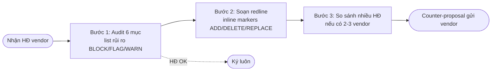

## Khi nào dùng quy trình này

- Vendor / khách hàng gửi HĐ template của họ, sếp bảo "review giúp"
- Procurement team chọn vendor mới, cần review HĐ trước ký
- M&A buyer review SPA seller đưa
- Pháp chế check HĐ NDA / DV / Vay trước ký

## Bạn cần chuẩn bị

<Steps>
  <Step title="HĐ cần audit">
    File Word / PDF / hoặc paste text
  </Step>
  <Step title="Stance của bạn">
    Pro-buyer? Pro-employer? Đứng ở vị thế nào để counter?
  </Step>
  <Step title="Vendor cùng category">
    (Optional) Nếu có 2-3 vendor cùng nộp HĐ → có thể benchmark side-by-side
  </Step>
</Steps>

## Flow 3 bước



## Chi tiết từng bước

<AccordionGroup>
  <Accordion title="Bước 1 — Audit 6 mục">
    Robot phù hợp với loại HĐ:
    - HĐ MB / NDA / HĐ Vay → `legal-contract-auditor` (umbrella)
    - HĐ DV → `legal-service-contract-auditor`
    - HĐ Thuê → `legal-rental-contract-auditor`
    - HĐLĐ → `legal-employment-contract-auditor`
    - HĐ Vay riêng → `legal-loan-contract-auditor`
    
    Robot xuất 2 file:
    - `audit.json` — danh sách issues máy đọc
    - `report.md` — báo cáo human-readable, verdict
    
    **Verdict 4 cấp**:
    - 🟢 APPROVED — ký được
    - 🟡 APPROVED_WITH_CHANGES — ký sau khi sửa minor
    - 🟠 REQUEST_CHANGES — cần negotiate
    - 🔴 BLOCKED — không thể ký
  </Accordion>
  <Accordion title="Bước 2 — Redline counter-proposal">
    Robot `legal-contract-redliner` lấy audit issues + stance của bạn → xuất file redline với marker:
    
    ```
    [REPLACE §5] "Bên vi phạm chịu phạt 12%" → "Bên vi phạm chịu phạt 8%"
    [CITE: LTM Đ.301 max 8%]
    [STANCE: pro-buyer]
    
    [ADD §7.3] Bổ sung clause limitation of liability cap = giá trị HĐ
    [REASON: bảo vệ bên mua trong trường hợp consequential damages]
    
    [DELETE §10] Loại clause auto-renewal vô thời hạn
    [REASON: ràng buộc dài hạn không có exit clause = bất lợi bên mua]
    ```
  </Accordion>
  <Accordion title="Bước 3 — Benchmark nhiều vendor">
    Nếu có 2-5 HĐ vendor cùng category → robot `legal-benchmark-comparator` so sánh 6 trục:
    
    | Trục | Vendor A | Vendor B | Vendor C |
    |------|----------|----------|----------|
    | Giá | 🟢 1B/năm | 🟡 1.2B | 🔴 1.5B |
    | Phạt | 🟢 5% | 🟡 8% (max) | 🔴 12% (vi phạm LTM) |
    | Lãi chậm | 🟢 8%/năm | 🟢 8% | 🟡 12% |
    | IP | 🟢 work for hire | 🟡 license | 🔴 không rõ |
    | Chấm dứt | 🟢 30d notice | 🟡 60d | 🔴 90d |
    | Tranh chấp | 🟢 TAND HN | 🟡 VIAC | 🟢 TAND HN |
    
    Output: matrix.json + report.md với verdict tổng + recommendation chọn vendor nào.
  </Accordion>
</AccordionGroup>

## Ví dụ thật: NDA Vendor SaaS

**Tình huống**: Vendor SaaS gửi HĐ NDA 4 trang. Bạn audit.

**Robot phát hiện 5 issues**:

| ID | Mức | Vấn đề | Cite | Đề xuất sửa |
|----|-----|--------|------|-------------|
| V-NDA-01 | 🔴 BLOCK | Phạm vi bí mật quá rộng — "mọi thông tin trao đổi" | BLDS Đ.387 | Giới hạn: chỉ "thông tin có dấu mật / labelled CONFIDENTIAL" |
| V-NDA-02 | 🟠 FLAG | Thời hạn bảo mật vĩnh viễn | SHTT Đ.84 | Đề xuất 3-5 năm sau chấm dứt HĐ |
| V-NDA-03 | 🟠 FLAG | Phạt vi phạm 1 tỷ/lần (vô lý) | LTM Đ.301 8% | Giảm còn 200M VND hoặc % giá trị HĐ |
| V-NDA-04 | 🟡 WARN | Không có exception cho disclosure theo pháp luật | - | Add exception: "trừ khi bắt buộc theo BLDS / cơ quan thẩm quyền" |
| V-NDA-05 | 🟡 WARN | Tranh chấp: SIAC Singapore | BLTTDS | Đề xuất VIAC hoặc TAND HN |

→ Verdict: **REQUEST_CHANGES** — cần negotiate 5 điểm trên.

→ Robot xuất redline file 3 trang, ready gửi vendor.

## Kết quả nhận được

<CardGroup cols={2}>
  <Card title="Audit report" icon="file-magnifying-glass">
    audit.json (máy đọc) + report.md (cho sếp đọc) ~12-15KB
  </Card>
  <Card title="Redline counter" icon="highlighter">
    File `.md` với markers ADD/DELETE/REPLACE inline, ready gửi vendor
  </Card>
  <Card title="Benchmark matrix" icon="table-columns">
    (Nếu 2+ vendor) matrix 6 trục + verdict + recommendation
  </Card>
  <Card title="Memo gửi sếp" icon="file-pen">
    (Optional) `legal-memo-drafter` tóm tắt rủi ro + action items
  </Card>
</CardGroup>

## Thời gian

- Audit: 5-10 phút
- Redline: 5-10 phút
- Benchmark (nếu có): 5-10 phút
- **Tổng**: 15-30 phút

## Lưu ý quan trọng

<Warning>
**Cite trap thường gặp khi audit**:
- HĐ DV: Đ.520 = chấm dứt, Đ.521 = TIẾP TỤC (đừng nhầm)
- HĐ Vay: Đ.471 = họ/hụi ≠ HĐ vay (dùng Đ.470 K.2)
- HĐ Thuê: BLDS Đ.472-499 (không Đ.430 mua bán)
- HĐLĐ: Đ.49 K.1 vô hiệu toàn bộ vs K.2 vô hiệu một phần (BHXH = K.2)
- HĐ MB B2B: phạt max **8%** LTM Đ.301 (HĐLĐ CẤM phạt tiền Đ.127 K.2)
</Warning>

## Robot dùng trong flow

<CardGroup cols={3}>
  <Card title="Auditor umbrella" icon="file-shield" href="/skills/contracts/contract-auditor">
    legal-contract-auditor
  </Card>
  <Card title="DV auditor" icon="briefcase" href="/skills/contracts/service-contract-auditor">
    legal-service-contract-auditor
  </Card>
  <Card title="Thuê auditor" icon="house-chimney" href="/skills/contracts/rental-contract-auditor">
    legal-rental-contract-auditor
  </Card>
  <Card title="HĐLĐ auditor" icon="user-tie" href="/skills/employment/employment-contract-auditor">
    legal-employment-contract-auditor
  </Card>
  <Card title="Redliner" icon="highlighter" href="/skills/contracts/contract-redliner">
    legal-contract-redliner
  </Card>
  <Card title="Benchmark" icon="table-columns" href="/skills/contracts/benchmark-comparator">
    legal-benchmark-comparator
  </Card>
</CardGroup>

## Bước tiếp theo

- Gửi redline cho vendor + negotiate
- Sau negotiate, ký xong → track via `legal-matter-tracker`
- Tạo `legal-obligation-extractor` để bóc nghĩa vụ → assign team
