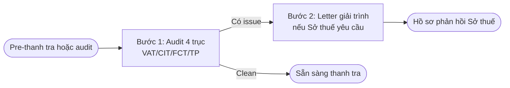

## Khi nào dùng quy trình này

- CFO / Kế toán trưởng pre-thanh tra thuế
- Pháp chế audit HĐ vendor nước ngoài (Salesforce, AWS) trước thanh toán
- M&A DD tax health-check
- Sở thuế gửi văn bản yêu cầu giải trình

## Bạn cần chuẩn bị

<Steps>
  <Step title="Hồ sơ thuế 1-3 năm">
    - BCTC đã audit
    - Tờ khai VAT / CIT / FCT đã nộp
    - Sổ kế toán
  </Step>
  <Step title="Danh sách HĐ với vendor nước ngoài">
    Loại HĐ (SaaS / consulting / royalty), giá trị, đã khấu trừ FCT chưa
  </Step>
  <Step title="Danh sách giao dịch với related party">
    Nếu có công ty mẹ / công ty con → cần check NĐ 132/2020 TP
  </Step>
</Steps>

## Flow 2 bước

## Chi tiết từng bước

<AccordionGroup>
  <Accordion title="Bước 1 — Audit 4 trục thuế">
    Robot `compliance-tax` kiểm:
    
    **1. VAT (Luật GTGT)**:
    - Applicability đúng % (0/5/8/10%)
    - NQ 142/2024/QH15 — VAT 8% giảm cho 2025-2026 (verify hết hạn chưa)
    - HĐ XK đúng 0%, không phải chuyển sang 8% nội địa
    
    **2. CIT (Luật TNDN)**:
    - Deductible expenses theo Đ.6 Luật TNDN
    - Non-deductible: tiền phạt vi phạm pháp luật / tiền tham nhũng / mức vượt quy định
    - Tax rate: 20% chuẩn / 17% SME / 10% R&D
    
    **3. FCT (TT 103/2014/TT-BTC)**:
    - Foreign contractor 10% deemed = 5% VAT + 5% CIT
    - Khi vendor nước ngoài có service rendered tại VN
    - SaaS từ US: 10% trên giá trị thanh toán
    - Royalty: 10% (CIT 5% nếu là licence cho technology transfer)
    
    **4. Transfer Pricing (NĐ 132/2020/NĐ-CP)**:
    - Bắt buộc TP doc nếu GTLK > 50B/năm
    - Method: CUP, RPM, CPM, TNMM, PSM (chọn method phù hợp)
    - Safe harbor: GTLK < 30 tỷ + ngành đơn giản
  </Accordion>
  <Accordion title="Bước 2 — Letter giải trình (nếu Sở thuế yêu cầu)">
    Robot `compliance-letter-drafter`:
    
    **4 loại letter**:
    - **Giải trình** (Sở thuế truy thu) — ≤ 30 ngày
    - **Khắc phục** (Sở thuế phát hiện vi phạm) — theo QĐ
    - **Response thanh tra** — ≤ 15-30 ngày
    - **Tự nguyện kê khai bổ sung** — chủ động trước thanh tra
    
    Letter có cấu trúc:
    - Tham chiếu văn bản Sở thuế (số / ngày)
    - Phản hồi từng điểm thuế bị nêu
    - Cite văn bản pháp luật làm cơ sở
    - Cam kết bổ sung / tự nguyện nộp / kháng nghị
  </Accordion>
</AccordionGroup>

## Ví dụ thật: HĐ Salesforce 1.5B/năm thiếu FCT

**Tình huống**: CTY thanh toán Salesforce US 1.5B VND/năm cho SaaS CRM. Kế toán chuyển khoản trực tiếp, KHÔNG khấu trừ FCT.

**Robot xuất**:

1. **Audit thuế** (Bước 1) — 8.4KB report:
   - 🔴 BLOCK: FCT chưa khấu trừ 3 năm liên tiếp
     - **Cite**: TT 103/2014/TT-BTC Đ.13
     - Ảnh hưởng: 150M/năm × 3 = **450M VND truy thu**
     - Phạt: 20% × 450M = 90M (Luật QLT 38/2019 Đ.142)
     - Lãi chậm: 0.03%/ngày × 450M × ~500 ngày = **~67M**
     - **Tổng rủi ro: ~607M VND**
   - 🟡 FLAG: VAT đầu vào không được hoàn vì không có hoá đơn VAT (SaaS US không phát hành hoá đơn VN)
   - 🟢 OK: CIT deductible (tính được vì là expense kinh doanh hợp lý)
   - 🟢 OK: Không có TP issue (Salesforce không phải related party)

2. **Letter giải trình** (Bước 2) — 7-8KB:
   - Tự nguyện kê khai bổ sung FCT
   - Đề xuất nộp đủ 450M + cam kết tuân thủ từ Q1/2027
   - Xin miễn phạt 20% (cite Đ.5 Luật QLT cho self-reporting before audit)

→ **Khuyến nghị**: Tự nguyện kê khai để giảm phạt từ 20% xuống 10%, tiết kiệm 45M.

## Kết quả nhận được

<CardGroup cols={2}>
  <Card title="Tax audit report" icon="receipt">
    4 trục VAT/CIT/FCT/TP, list issues + ước tính ảnh hưởng VND
  </Card>
  <Card title="Letter giải trình" icon="envelope">
    Theo yêu cầu Sở thuế hoặc tự nguyện, 7-8KB docx
  </Card>
  <Card title="Roadmap khắc phục" icon="route">
    Timeline + action items theo tháng
  </Card>
  <Card title="Memo gửi CFO/CEO" icon="file-pen">
    Tóm tắt rủi ro + recommendation (optional)
  </Card>
</CardGroup>

## Thời gian

- Audit 4 trục: 15-20 phút
- Letter giải trình: 5-10 phút
- **Tổng**: 20-30 phút

## Lưu ý quan trọng

<Warning>
**Cite trap thuế**:
- **FCT 10% deemed** = 5% VAT + 5% CIT (TT 103/2014)
- **NĐ 132/2020 TP** bắt buộc nếu GTLK > 50B/năm
- **NĐ 69/2025/NĐ-CP** (hiệu lực 19/05/2025) sửa đổi NĐ 01/2014 K.5 thêm K.6a exception
- **NQ 142/2024/QH15** VAT 8% giảm — verify hết hạn 31/12/2026 chưa
- **Luật QLT 38/2019** hiệu lực 01/07/2020 (đừng dùng Luật QLT cũ 78/2006)
</Warning>

## Robot dùng trong flow

<CardGroup cols={3}>
  <Card title="Audit thuế" icon="receipt" href="/skills/compliance/compliance-tax">
    compliance-tax
  </Card>
  <Card title="Letter compliance" icon="envelope" href="/skills/compliance/compliance-letter-drafter">
    compliance-letter-drafter
  </Card>
  <Card title="Memo (optional)" icon="file-pen" href="/skills/meta/memo-drafter">
    memo-drafter
  </Card>
</CardGroup>

## Bước tiếp theo

- Nộp letter giải trình + hồ sơ bổ sung cho Sở thuế
- Update internal control: yêu cầu kế toán FCT trước mọi payment vendor nước ngoài
- Annual review tax compliance → tích hợp vào `compliance-dashboard`
