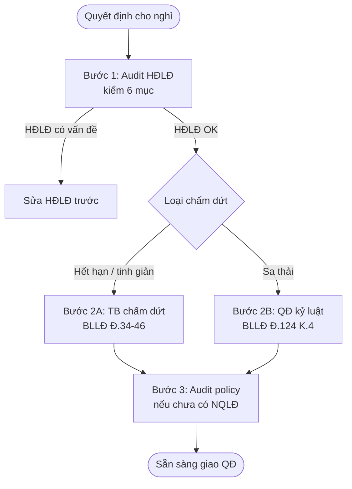

## Khi nào dùng quy trình này

- HR cần cho NLĐ nghỉ (hết hạn HĐ, tinh giản, hết tuổi)
- DN sa thải do vi phạm nghiêm trọng
- Pháp chế cần audit risk trước khi quyết định kỷ luật
- Tránh bị NLĐ kiện ngược lại tại Toà

<Warning>
Tranh chấp HĐLĐ CHỈ Toà án (không VIAC / Trọng tài). Phải làm đúng quy trình tránh thua kiện + bồi thường.
</Warning>

## Bạn cần chuẩn bị

<Steps>
  <Step title="HĐLĐ gốc">
    File HĐLĐ NLĐ cần xử lý (PDF / Word)
  </Step>
  <Step title="Lý do chấm dứt">
    Hết hạn / đơn phương (Đ.36) / kỷ luật sa thải (Đ.124 K.4) / nghỉ hưu / mất NLĐ?
  </Step>
  <Step title="Bằng chứng vi phạm (nếu sa thải)">
    Tài liệu chứng minh hành vi vi phạm: video / nhân chứng / hồ sơ
  </Step>
  <Step title="Thâm niên NLĐ">
    Để tính trợ cấp thôi việc (Đ.46) hoặc mất việc (Đ.42)
  </Step>
</Steps>

## Flow 3 bước

## Chi tiết từng bước

<AccordionGroup>
  <Accordion title="Bước 1 — Audit HĐLĐ trước">
    Robot `legal-employment-contract-auditor` kiểm 6 mục:
    
    1. **10 nội dung Đ.21 K.1** (a → k)
    2. **Đ.20 loại HĐ** (không xác định / xác định / thời vụ)
    3. **Đ.24-27 thử việc** (max 60/180 ngày)
    4. **NĐ 293/2025 lương tối thiểu** vùng I = **5.31M** (01/01/2026)
    5. **Đ.105 thời giờ** max 48h/tuần
    6. **Đ.127/Đ.17 K.2 cấm phạt tiền + giữ giấy tờ gốc**
    
    Nếu HĐLĐ thiếu BHXH → **Đ.49 K.2 vô hiệu PHẦN BHXH** (không toàn bộ).
    Nếu lương < 5.31M (vùng I) → vô hiệu phần lương + truy thu.
  </Accordion>
  <Accordion title="Bước 2A — TB chấm dứt (hết hạn / đơn phương / tinh giản)">
    Robot `legal-employment-termination-drafter` umbrella:
    
    **Đơn phương Đ.36 K.2** báo trước:
    - HĐ không xác định: **45 ngày**
    - HĐ xác định 12-36 tháng: **30 ngày**
    - HĐ thời vụ < 12 tháng: **3 ngày**
    
    **Đ.37 CẤM 7 trường hợp** đơn phương:
    - Thai sản (≤6 tháng sau sinh)
    - Ốm đau (đang điều trị)
    - Nghỉ phép theo quy định
    - Cán bộ CĐCS đang nhiệm kỳ
    - Đang nghỉ thai sản
    - ...
    
    **Đ.46 K.2 trợ cấp thôi việc**: TRỪ thời gian đóng BHTN. Mỗi năm = 0.5 tháng lương.
    
    **Đ.42 K.1 trợ cấp mất việc** (tinh giản): ≥ 2 tháng lương.
    
    **Tuổi hưu 2026**: 61y6m nam / 57y nữ (NĐ 135/2020 → 2028 = 62/60).
  </Accordion>
  <Accordion title="Bước 2B — QĐ kỷ luật sa thải">
    Robot `legal-disciplinary-decision-drafter`:
    
    **4 hình thức kỷ luật (Đ.124)**:
    1. Khiển trách (K.1)
    2. Kéo dài thời hạn nâng lương ≤6 tháng (K.2)
    3. Cách chức (K.3)
    4. **Sa thải (K.4) + chấm dứt HĐLĐ (Đ.34 K.8 — KHÔNG K.1c)**
    
    **Đ.125 K.1 căn cứ sa thải**:
    a) Trộm cắp / tham ô / đánh bạc / cố ý gây thương tích / sử dụng ma tuý
    b) Tiết lộ bí mật KD / xâm phạm SHTT / gây thiệt hại nghiêm trọng
    c) Tự ý nghỉ ≥ 5 ngày liên tiếp hoặc ≥ 20 ngày/năm
    
    **Thời hiệu**: 6 tháng mặc định / 12 tháng nếu tài sản + bí mật KD.
    
    **Quy trình họp xử lý kỷ luật (Đ.122)** BẮT BUỘC:
    1. Mời họp ≥ 5 ngày làm việc trước
    2. Lập BB họp (phải có chữ ký NLĐ + đại diện CĐCS)
    3. Ra QĐ kỷ luật trong thời hiệu
  </Accordion>
  <Accordion title="Bước 3 — Audit policy (NQLĐ)">
    Robot `legal-policy-auditor` check NQLĐ DN có:
    - Đủ 7 nội dung Đ.118 K.2
    - CẤM phạt tiền NLĐ Đ.127 K.2
    - Hành vi vi phạm + hình thức kỷ luật rõ ràng (cơ sở pháp lý cho sa thải)
    
    Nếu NQLĐ thiếu → sa thải có thể bị Toà tuyên VÔ HIỆU.
  </Accordion>
</AccordionGroup>

## Ví dụ thật: Sa thải NLĐ trộm cắp 50M

**Tình huống**: NLĐ A tự ý chuyển 50M từ tài khoản CTY → tài khoản cá nhân. Có CCTV + Sao kê. CTY muốn sa thải.

**Robot xuất**:

1. **Audit HĐLĐ A** (Bước 1):
   - 🟢 HĐ không xác định
   - 🟢 Đủ 10 nội dung Đ.21 K.1
   - 🟢 Lương 15M > 5.31M vùng I
   - 🟢 BHXH đóng đủ
   → HĐLĐ OK, ready để xử lý kỷ luật.

2. **QĐ kỷ luật sa thải** (Bước 2B) — 12.4KB:
   - Căn cứ Đ.124 K.4 + Đ.34 K.8 BLLĐ
   - Hành vi vi phạm: Đ.125 K.1 a (tham ô + trộm cắp)
   - Thời hiệu: 12 tháng (Đ.123 K.2)
   - Quy trình: họp BB ngày X có chữ ký NLĐ + CĐCS
   - QĐ ban hành ngày Y
   - **KHÔNG trợ cấp thôi việc** (Đ.46 K.1 — trừ trường hợp sa thải do bệnh)

3. **Audit NQLĐ CTY** (Bước 3):
   - 🟢 Có quy định cấm tham ô / trộm cắp (Điều 12 NQLĐ)
   - 🟢 Có thẩm quyền sa thải (GĐ)
   - 🟢 KHÔNG có điều khoản phạt tiền NLĐ (đúng Đ.127 K.2)
   → NQLĐ OK, không có rủi ro Toà tuyên QĐ vô hiệu.

## Kết quả nhận được

<CardGroup cols={2}>
  <Card title="HĐLĐ audit" icon="file-shield">
    6 pillar checklist + verdict OK / cần sửa
  </Card>
  <Card title="TB chấm dứt hoặc QĐ kỷ luật" icon="door-open">
    docx 12-13KB đầy đủ căn cứ Đ.34-46 hoặc Đ.124 K.4
  </Card>
  <Card title="NQLĐ audit" icon="scroll">
    Verify policy có hỗ trợ quyết định không
  </Card>
  <Card title="Checklist quy trình" icon="list-check">
    Các bước họp xử lý + BB + thời gian + chữ ký
  </Card>
</CardGroup>

## Thời gian

- Audit HĐLĐ: 10 phút
- Soạn TB / QĐ: 10-15 phút
- Audit NQLĐ: 5-10 phút
- **Tổng**: 25-35 phút

## Lưu ý quan trọng

<Warning>
**Cite trap HR/LĐ**:
- Sa thải = **Đ.124 K.4 + Đ.34 K.8** (KHÔNG K.1c)
- **Đ.49 K.1 vô hiệu TOÀN BỘ** vs **K.2 vô hiệu MỘT PHẦN** (BHXH = K.2)
- **NĐ 293/2025 vùng I = 5.31M** (01/01/2026)
- BHXH ở **điểm i = mục #9** Đ.21 K.1 (KHÔNG #6)
- Tuổi hưu 2026: **61y6m nam / 57y nữ** (NĐ 135/2020)
- **CẤM phạt tiền NLĐ** (Đ.127 K.2)
- Tranh chấp HĐLĐ **CHỈ Toà án** (không VIAC)
</Warning>

## Robot dùng trong flow

<CardGroup cols={3}>
  <Card title="Audit HĐLĐ" icon="user-tie" href="/skills/employment/employment-contract-auditor">
    legal-employment-contract-auditor
  </Card>
  <Card title="TB chấm dứt" icon="door-open" href="/skills/employment/employment-termination-drafter">
    legal-employment-termination-drafter
  </Card>
  <Card title="QĐ kỷ luật" icon="gavel" href="/skills/employment/disciplinary-decision-drafter">
    legal-disciplinary-decision-drafter
  </Card>
  <Card title="Audit NQLĐ" icon="shield-check" href="/skills/corporate/policy-auditor">
    legal-policy-auditor
  </Card>
</CardGroup>

## Bước tiếp theo

- Giao QĐ cho NLĐ + lưu hồ sơ
- Nếu NLĐ khiếu nại / khởi kiện → [Chuẩn bị ra Tòa](/scenarios/chuan-bi-ra-toa) (CTY là Bị đơn)
- Update NQLĐ nếu có gap → `legal-internal-rules-drafter`
