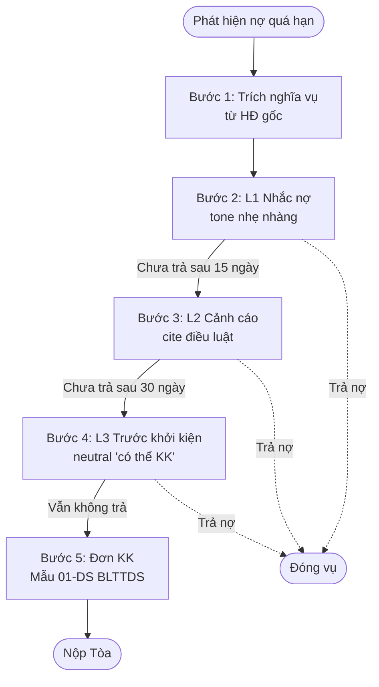

## Khi nào dùng quy trình này

- Khách hàng trễ thanh toán hợp đồng > 30 ngày
- Vendor không hoàn tiền đặt cọc
- Đối tác vay tiền không trả đúng kỳ
- Bạn cần "paper trail" trước khi kiện ra Tòa

## Bạn cần chuẩn bị

<Steps>
  <Step title="HĐ gốc">
    File HĐ giữa hai bên (PDF / Word) — robot sẽ trích nghĩa vụ
  </Step>
  <Step title="Lịch sử thanh toán">
    Số tiền nợ, ngày đáo hạn, các email/SMS đã đòi nợ trước đó
  </Step>
  <Step title="Quyết định escalate">
    Còn quan hệ business: dùng L1 nhẹ. Sẵn sàng kiện: chuyển thẳng L3.
  </Step>
</Steps>

## Flow 4 bước

### Chi tiết từng bước

<AccordionGroup>
  <Accordion title="Bước 1 — Trích nghĩa vụ từ HĐ">
    Robot `obligation-extractor` đọc HĐ → liệt kê **chính xác**: ai phải trả ai, bao nhiêu, hạn nào, phạt nếu trễ.
    
    Output: JSON các nghĩa vụ + ảnh chụp trang HĐ tương ứng (làm evidence).
  </Accordion>
  <Accordion title="Bước 2 — L1 Nhắc nợ (tone nhẹ)">
    Robot `debt-warning-letter` branch `nhac_no` xuất 1 letter ~1 trang:
    - Tone: lịch sự, "có lẽ có sự nhầm lẫn"
    - KHÔNG cite điều luật
    - Hạn trả thêm: 10-15 ngày
    
    Khi nào dùng: Còn muốn giữ quan hệ business.
  </Accordion>
  <Accordion title="Bước 3 — L2 Cảnh cáo (cite điều luật)">
    Robot `debt-warning-letter` branch `canh_cao`:
    - Tone: nghiêm khắc
    - Cite **LTM Đ.306** (lãi chậm trả TM) hoặc **BLDS Đ.357** (lãi chậm trả dân sự)
    - Cite **LTM Đ.301** (phạt vi phạm tối đa 8%)
    - Tính cụ thể số tiền lãi + phạt
    - Hạn trả thêm: 7-10 ngày
  </Accordion>
  <Accordion title="Bước 4 — L3 Trước khởi kiện (neutral)">
    Robot `debt-warning-letter` branch `truoc_khoi_kien`:
    - Tone: **NEUTRAL** "Công ty có thể xem xét quyền khởi kiện theo BLTTDS"
    - KHÔNG đe doạ trực tiếp (unethical)
    - Cite **Đ.186 BLTTDS** (quyền KK) + **Đ.429 BLDS** (thời hiệu 3 năm)
    - Hạn trả thêm: 7 ngày cuối
  </Accordion>
  <Accordion title="Bước 5 — Đơn khởi kiện">
    Nếu vẫn không trả, robot `tranh-tung-drafter` xuất Đơn KK đúng **Mẫu 01-DS BLTTDS 2015**.
    
    Trước khi nộp Tòa: robot `pleading-validator` audit 6 mục (thẩm quyền, thời hiệu, yêu cầu KK, án phí...).
  </Accordion>
</AccordionGroup>

## Kết quả nhận được

<CardGroup cols={2}>
  <Card title="3 letter docx" icon="envelope">
    - L1 Nhắc nợ ~12KB
    - L2 Cảnh cáo ~13KB
    - L3 Trước khởi kiện ~13KB
  </Card>
  <Card title="Đơn KK đầy đủ" icon="file-contract">
    - Mẫu 01-DS BLTTDS
    - + audit pre-filing
    - + checklist tài liệu kèm
  </Card>
</CardGroup>

## Ví dụ thật

**Tình huống**: Công ty XYZ ký HĐ DV consulting 1.2 tỷ VND với Công ty ABC. ABC giao hàng đúng nhưng XYZ quá hạn 60 ngày không thanh toán.

**Robot chạy**:

1. **Trích nghĩa vụ**: XYZ phải trả 1.2 tỷ trong 30 ngày sau bàn giao (Điều 5 HĐ). Đã quá 60 ngày.
2. **L1 (ngày 1)**: "Có lẽ có sự nhầm lẫn, vui lòng thanh toán trong 15 ngày" → ngắn gọn 12,168 bytes
3. **L2 (ngày 16)**: "Vi phạm Điều 5 HĐ. Theo LTM Đ.306, công ty XYZ phải chịu lãi 13.5%/năm × 60 ngày = 26.6M VND. Phạt 8% giá trị HĐ = 96M VND (LTM Đ.301). Tổng = 1.322 tỷ" → 13KB
4. **L3 (ngày 26)**: "Sau 7 ngày, công ty ABC có thể xem xét quyền khởi kiện theo BLTTDS Đ.186" → 12,987 bytes
5. **Đơn KK (ngày 33)**: Mẫu 01-DS, thẩm quyền TAND TP HCM (nơi XYZ trụ sở), yêu cầu 1.322 tỷ + lãi tiếp tục, án phí 33.3M (NĐ 326/2016).

→ XYZ thường trả ở L2 hoặc L3 sau khi xem chi tiết tính lãi + phạt.

## Thời gian

- L1 + L2 + L3 viết: ~5 phút mỗi cấp
- Đơn KK + audit: ~15 phút
- **Tổng**: 30 phút từ phát hiện nợ → sẵn sàng nộp Tòa

## Lưu ý quan trọng

<Warning>
**Cite trap thường gặp**:
- Đ.466 K.5 BLDS (lãi quá hạn 150%) CHỈ áp HĐ Vay — HĐ MB/DV phải dùng Đ.357 BLDS hoặc LTM Đ.306
- LTM Đ.301 max 8% phạt B2B (đừng nhầm với HĐLĐ — HĐLĐ CẤM phạt tiền)
- Thời hiệu **HĐ = 3 năm Đ.429 BLDS** (sửa từ 2 năm BLDS 2005)
</Warning>

## Robot dùng trong flow

<CardGroup cols={3}>
  <Card title="Trích nghĩa vụ" icon="list-tree" href="/skills/intake/obligation-extractor">
    obligation-extractor
  </Card>
  <Card title="Letter L1/L2/L3" icon="envelope" href="/skills/litigation/debt-warning-letter">
    debt-warning-letter
  </Card>
  <Card title="Workflow escalation" icon="stairs" href="/skills/litigation/debt-escalation">
    debt-escalation
  </Card>
  <Card title="Đơn KK" icon="scale-balanced" href="/skills/litigation/tranh-tung-drafter">
    tranh-tung-drafter
  </Card>
  <Card title="Validator pre-filing" icon="magnifying-glass-chart" href="/skills/litigation/pleading-validator">
    pleading-validator
  </Card>
</CardGroup>
