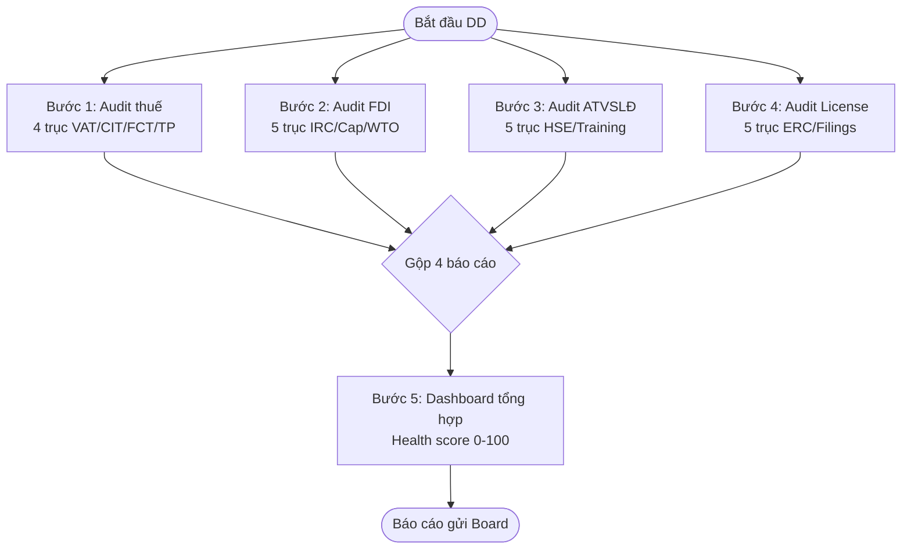

## Khi nào dùng quy trình này

Sếp giao bạn rà soát 1 công ty muốn mua. Bạn cần biết công ty đó có "khỏe" về mặt pháp lý không — thuế / đầu tư / an toàn lao động / giấy phép đầy đủ?

Đây là M&A Due Diligence (DD) — bước **BẮT BUỘC** trước khi ký SPA.

## Bạn cần chuẩn bị

<Steps>
  <Step title="Thông tin cơ bản">
    Tên công ty target, MST (mã số DN), ngành KD chính
  </Step>
  <Step title="4 nguồn dữ liệu">
    - **Thuế**: BCTC 3 năm gần nhất + invoice mẫu + danh sách HĐ với nhà cung cấp
    - **FDI**: ERC + IRC (nếu có) + tỷ lệ vốn nước ngoài
    - **ATVSLĐ**: Hội đồng ATVSLĐ + huấn luyện 6 nhóm + báo cáo TNLĐ 2 năm
    - **License**: Giấy phép con (theo VSIC) + báo cáo định kỳ thuế/BHXH/LĐ/MT
  </Step>
  <Step title="Scope DD">
    Buyer-side hay Seller-side? Confidentiality level? Deadline?
  </Step>
</Steps>

## Flow 5 bước

### Chi tiết từng bước

<CardGroup cols={2}>
  <Card title="Bước 1: Audit thuế" icon="receipt">
    Robot kiểm 4 mục: VAT (đúng %), CIT (deductible), FCT (vendor nước ngoài), Transfer Pricing (nếu giao dịch với mẹ).
    
    Robot dùng: `compliance-tax`
  </Card>
  <Card title="Bước 2: Audit FDI" icon="earth-asia">
    Robot kiểm 5 mục: cần IRC không, ngành cấm, ngành điều kiện, ownership cap, vượt WTO commitment.
    
    Robot dùng: `compliance-fdi`
  </Card>
  <Card title="Bước 3: Audit ATVSLĐ" icon="helmet-safety">
    Robot kiểm 5 mục: Hội đồng ATVSLĐ, huấn luyện 6 nhóm, PPE, khám SK, BC TNLĐ.
    
    Robot dùng: `compliance-safety`
  </Card>
  <Card title="Bước 4: Audit License" icon="clipboard-check">
    Robot kiểm 5 mục: ERC active, ngành KD match, license con còn hạn, báo cáo định kỳ, beneficial ownership.
    
    Robot dùng: `compliance-audit`
  </Card>
</CardGroup>

**Bước 5: Dashboard tổng hợp**

Robot `compliance-dashboard` đọc 4 báo cáo audit → tính điểm sức khỏe 0-100 + xếp hạng top 5 rủi ro lớn nhất.

## Kết quả nhận được

<CardGroup cols={2}>
  <Card title="4 báo cáo audit chi tiết" icon="file-pdf">
    - tax-audit.json + report
    - fdi-audit.json + report
    - safety-audit.json + report
    - license-audit.json + report
  </Card>
  <Card title="1 dashboard tổng hợp" icon="chart-pie">
    - Health score 0-100
    - Verdict: APPROVED / WITH_WATCH / REQUEST_CHANGES / BLOCKED
    - Top 5 rủi ro sắp xếp theo mức ảnh hưởng VND
  </Card>
</CardGroup>

## Ví dụ thật

**Target**: ABC F&B Co. (chuỗi nhà hàng 30 chi nhánh, target M&A trị giá 100 tỷ VND)

| Mục | Kết quả robot | Tình trạng |
|-----|---------------|------------|
| **Thuế** | Thiếu FCT cho Salesforce SaaS 1.5 tỷ/năm | 🟡 Cảnh báo (ảnh hưởng 150M VND/năm) |
| **FDI** | Investor Hàn 100%, bán lẻ F&B | 🟢 OK (mở 100% từ 2015) |
| **ATVSLĐ** | Thiếu Hội đồng (>50 NLĐ loại III) | 🔴 Nghiêm trọng |
| **License** | ERC + ATTP + PCCC đều active | 🟢 OK |

→ **Điểm tổng: 72/100 → "Approved with Watch"**

→ **Top 3 rủi ro**:
1. Setup Hội đồng ATVSLĐ trong 30 ngày trước thanh tra (rủi ro phạt 100M)
2. Truy thu FCT 3 năm (rủi ro 450M)
3. Bổ sung TP doc (NĐ 132/2020) vì giao dịch với mẹ

→ **Khuyến nghị Board**: Approve thương vụ nhưng cần escrow 1 tỷ cho rủi ro ATVSLĐ + FCT post-closing.

## Thời gian

- **Tự động chạy**: 25-30 phút (4 audit parallel + 5 phút dashboard)
- **Nếu data thiếu**: + 1-2 ngày bạn xin thêm từ target

## Robot dùng trong flow này

<CardGroup cols={3}>
  <Card title="Audit thuế" icon="receipt" href="/skills/compliance/compliance-tax">
    compliance-tax
  </Card>
  <Card title="Audit FDI" icon="earth-asia" href="/skills/compliance/compliance-fdi">
    compliance-fdi
  </Card>
  <Card title="Audit ATVSLĐ" icon="helmet-safety" href="/skills/compliance/compliance-safety">
    compliance-safety
  </Card>
  <Card title="Audit License" icon="clipboard-check" href="/skills/compliance/compliance-audit">
    compliance-audit
  </Card>
  <Card title="Dashboard" icon="chart-pie" href="/skills/compliance/compliance-dashboard">
    compliance-dashboard
  </Card>
  <Card title="Route case" icon="route" href="/skills/meta/legal-case-runner">
    legal-case-runner (auto chọn pipeline này)
  </Card>
</CardGroup>

## Bước tiếp theo trong DD process

Sau khi robot xong, bạn:
1. Đọc dashboard + top 5 rủi ro
2. Viết memo gửi Board → dùng [Soạn HĐ cho client](/scenarios/soan-hop-dong) memo template
3. Negotiate SPA + escrow → dùng `share-transfer-contract-drafter`
4. Sau ký, monitor compliance → dùng `matter-tracker`
