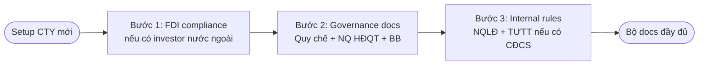

## Khi nào dùng quy trình này

- Khách hàng / sếp giao thành lập công ty mới (JSC / LLC)
- Investor nước ngoài muốn lập DN tại VN
- Spin-off / chia tách → tạo CTY con
- IPO prep: chuẩn bộ governance docs đầy đủ

## Bạn cần chuẩn bị

<Steps>
  <Step title="Loại hình DN">
    JSC (cổ phần) hay LLC (TNHH ≥2 TV hay 1 TV)?
  </Step>
  <Step title="Cổ đông / Thành viên">
    Tên + MST + ownership % + có nước ngoài không?
  </Step>
  <Step title="Ngành KD">
    VSIC code chính + secondary (để check Phụ lục cấm/có điều kiện)
  </Step>
  <Step title="Quy mô NLĐ">
    < 10 hay > 10 (quyết định có cần NQLĐ)?
  </Step>
</Steps>

## Flow 3 bước



## Chi tiết từng bước

<AccordionGroup>
  <Accordion title="Bước 1 — FDI check (nếu có nước ngoài)">
    Robot `legal-compliance-fdi` kiểm 5 trục:
    1. Cần IRC không? (Luật ĐT Đ.36 — vốn FDI > 50% phải có)
    2. Ngành cấm? (Phụ lục I — vd: cờ bạc, hoá chất độc)
    3. Ngành điều kiện? (Phụ lục II + III — vd: bán lẻ, ngân hàng)
    4. Ownership cap? (bank 30%, telecom 49%, bán lẻ 100%)
    5. WTO commitment? (vượt → cần MOI approval)
    
    Output: Roadmap thủ tục bước 1 → bước N với timeline.
  </Accordion>
  <Accordion title="Bước 2 — Governance docs (JSC/LLC)">
    Robot `legal-corporate-governance-drafter` (umbrella 3 nhánh):
    
    **Cho JSC**:
    - Quy chế tổ chức và hoạt động (Đ.138-153 LDN)
    - Quy chế nhân sự
    - Quy chế quản trị
    - NQ HĐQT (Đ.157)
    - BB HĐQT (Đ.158)
    
    **Cho LLC ≥2 TV**:
    - Tương tự + BB họp HĐTV (Đ.55-66 LDN)
    
    Robot tự lock cite + đảm bảo thẩm quyền đúng (TGĐ tự ký Quy chế TC = vô hiệu).
  </Accordion>
  <Accordion title="Bước 3 — Internal rules (NQLĐ + TƯTT)">
    Robot `legal-internal-rules-drafter`:
    
    **NQLĐ** (BẮT BUỘC nếu ≥10 NLĐ, Đ.118 K.1 BLLĐ):
    7 nội dung bắt buộc (Đ.118 K.2):
    a) Thời giờ làm việc / nghỉ ngơi
    b) Trật tự nơi làm việc
    c) ATVSLĐ
    d) Phòng chống QRTD
    e) Bảo vệ tài sản, bí mật KD
    f) Trường hợp tạm thuyên chuyển
    g) Hành vi vi phạm + hình thức kỷ luật
    
    **TƯTT** (nếu có CĐCS):
    Thỏa thuận tập thể với CĐCS, đăng ký Sở LĐTBXH.
    
    Robot enforce **CẤM phạt tiền** (Đ.127 K.2).
  </Accordion>
</AccordionGroup>

## Ví dụ thật: JSC F&B 100% FDI Hàn Quốc

**Input**:
```
Loại hình: JSC
Cổ đông: A Korea Co. 100% (Korean investor)
Ngành: bán lẻ thực phẩm F&B
NLĐ dự kiến: 50 người (chuỗi 3 nhà hàng)
Có CĐCS: chưa
```

**Robot xuất**:

1. **FDI audit** (Bước 1):
   - 🟢 Cần IRC (vốn FDI 100%)
   - 🟢 Bán lẻ F&B KHÔNG trong Phụ lục I/II/III
   - 🟢 Mở 100% từ 11/01/2015 sau WTO commitment
   - 🟢 Không cần MOI approval
   - Roadmap: IRC (15 ngày) → ERC (5 ngày) → MST → con dấu → ngân hàng

2. **Governance docs** (Bước 2):
   - Quy chế TC/NS/QT (3 files docx ~13KB mỗi)
   - NQ HĐQT họp đầu nhiệm kỳ (~12KB)
   - BB HĐQT (~12KB)
   - 5 file tổng

3. **Internal rules** (Bước 3):
   - NQLĐ 50 NLĐ (~15.6KB)
   - Chưa có TƯTT (CĐCS chưa lập)

→ **Tổng**: 8 file docx, sẵn sàng nộp Sở KH-ĐT + Sở LĐTBXH.

## Kết quả nhận được

<CardGroup cols={2}>
  <Card title="FDI roadmap" icon="route">
    Timeline thủ tục + cite Luật ĐT 61/2020 + NĐ liên quan
  </Card>
  <Card title="Governance package" icon="file-contract">
    Quy chế TC/NS/QT + NQ HĐQT + BB HĐQT + Quy chế tài chính
  </Card>
  <Card title="Internal rules" icon="scroll">
    NQLĐ chuẩn 7 nội dung + TƯTT (nếu có CĐCS)
  </Card>
  <Card title="Notice templates" icon="envelope-open">
    TB triệu tập họp ĐHĐCĐ / HĐTV theo thời hạn LDN
  </Card>
</CardGroup>

## Thời gian

- FDI audit: 10-15 phút
- Governance docs: 15-20 phút (5 files)
- Internal rules: 10-15 phút
- **Tổng**: 30-60 phút

## Lưu ý quan trọng

<Warning>
**Cite trap cho setup CTY**:
- Hội đồng ATVSLĐ = **Luật ATVSLĐ Đ.75** (KHÔNG BLLĐ Đ.136 K.1)
- TGĐ KHÔNG có thẩm quyền ban hành Quy chế TC (LDN Đ.138-153 — phải HĐQT)
- NQLĐ phải có đủ **7 nội dung Đ.118 K.2** mới hợp lệ
- **CẤM phạt tiền NLĐ** (BLLĐ Đ.127 K.2)
- TƯTT số_qd_ban_hanh phải dùng `01/QĐ-TUTT-XXX` (validator yêu cầu /QĐ- prefix)
</Warning>

## Robot dùng trong flow

<CardGroup cols={3}>
  <Card title="FDI audit" icon="earth-asia" href="/skills/compliance/compliance-fdi">
    legal-compliance-fdi
  </Card>
  <Card title="Governance" icon="building-columns" href="/skills/corporate/governance-drafter">
    legal-corporate-governance-drafter
  </Card>
  <Card title="Internal rules" icon="scroll" href="/skills/corporate/internal-rules-drafter">
    legal-internal-rules-drafter
  </Card>
  <Card title="ĐHĐCĐ (JSC)" icon="users-line" href="/skills/corporate/shareholder-meeting-drafter">
    legal-shareholder-meeting-drafter
  </Card>
  <Card title="HĐTV (LLC)" icon="people-group" href="/skills/corporate/member-council-meeting-drafter">
    legal-member-council-meeting-drafter
  </Card>
  <Card title="Notice họp" icon="envelope-open" href="/skills/corporate/meeting-notice-drafter">
    legal-meeting-notice-drafter
  </Card>
</CardGroup>

## Bước tiếp theo

- Sau khi có docs đầy đủ → nộp Sở KH-ĐT + Sở LĐTBXH
- Setup compliance monitoring → `legal-compliance-audit`
- HR onboarding → [Cho NLĐ nghỉ](/scenarios/cho-nld-nghi) (reverse flow cho HR)
