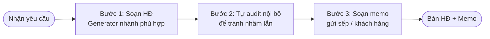

## Khi nào dùng quy trình này

- Khách hàng yêu cầu soạn HĐ mới (MB / DV / HĐLĐ / Đại lý / Vay)
- Bạn cần draft phục vụ negotiate
- In-house GC chuẩn HĐ template cho team Procurement / Sales
- M&A bên buy cần draft SPA

## Bạn cần chuẩn bị

<Steps>
  <Step title="Thông tin 2 bên">
    Tên + MST + địa chỉ + người đại diện + chức vụ
  </Step>
  <Step title="Đối tượng HĐ">
    Hàng hóa / dịch vụ gì? Số lượng / mô tả / specs?
  </Step>
  <Step title="Điều khoản kinh tế">
    Giá, thanh toán, bảo hành, phạt vi phạm, lãi chậm
  </Step>
  <Step title="Stance">
    Bên nào "pro-side"? Pro-buyer / pro-seller / pro-employer / neutral?
  </Step>
</Steps>

## Flow 3 bước



## 5 nhánh HĐ phổ biến

<CardGroup cols={2}>
  <Card title="HĐ Mua bán B2B" icon="cart-shopping">
    BLDS Đ.430-449 + LTM 2005. Smoke test: 14KB docx, 10 điều canonical.
  </Card>
  <Card title="HĐ Dịch vụ" icon="briefcase">
    BLDS Đ.513-521 + SHTT (nếu có IP). Smoke test: 15-17KB docx.
  </Card>
  <Card title="HĐ Lao động" icon="user-tie">
    BLLĐ Đ.13-22 + NĐ 293/2025 lương vùng. Đầy đủ 10 nội dung Đ.21 K.1.
  </Card>
  <Card title="HĐ Vay" icon="hand-holding-dollar">
    BLDS Đ.464-471. B2B hoặc P2P. Cẩn thận Đ.470 K.2 cấm trả sớm vô điều kiện.
  </Card>
  <Card title="HĐ Đại lý" icon="people-arrows">
    LTM Đ.166-177. Độc quyền hoặc không độc quyền. Đ.177 báo trước 60 ngày.
  </Card>
</CardGroup>

## Ví dụ thật: HĐ Mua bán B2B 1 tỷ VND

**Input bạn gõ cho robot**:

```
Bên Bán: Công ty A, MST 0123456789, đại diện ông Nguyễn Văn A
Bên Mua: Công ty B, MST 0987654321, đại diện bà Trần Thị B
Đối tượng: 100 máy tính laptop Dell Latitude 5440
Giá: 10 triệu/máy × 100 = 1 tỷ VND
Thanh toán: 30% đặt cọc + 70% sau giao hàng đủ
Bảo hành: 12 tháng tại trụ sở Bên Mua
Phạt vi phạm: max 8% giá trị vi phạm (LTM Đ.301)
Tranh chấp: TAND Hà Nội
Stance: pro-seller (Bên Bán)
```

**Robot xuất**:

`hop-dong-mua-ban-2026-05-17.docx` — 15KB

Cấu trúc 10 điều canonical:
1. Đối tượng HĐ
2. Số lượng và Chất lượng (Đ.435)
3. Giá và Thanh toán (Đ.431)
4. Giao hàng (Đ.432)
5. Bảo hành (Đ.446 BLDS + LTM Đ.49)
6. Quyền và Nghĩa vụ
7. Phạt vi phạm (max 8% LTM Đ.301)
8. Lãi chậm thanh toán (LTM Đ.306)
9. Bất khả kháng (Đ.156)
10. Tranh chấp (Toà án Hà Nội theo Đ.39 K.1 BLTTDS)

**Cite trap đã tránh**:
- Bảo hành dùng **BLDS Đ.446 + LTM Đ.49** (KHÔNG SHTT Đ.46)
- Lãi chậm dùng **BLDS Đ.357 / LTM Đ.306** (KHÔNG Đ.466 K.5 — đó là HĐ Vay)
- Số lượng dùng **Đ.437** (không nhầm với Đ.438 = đồng bộ)

## Bước 3: Memo gửi sếp/khách

Sau khi có HĐ, robot `legal-memo-drafter` sinh memo 5 sections (IRAC):

```
VẤN ĐỀ: Soạn HĐ MB 100 máy tính 1 tỷ
CƠ SỞ PHÁP LÝ: BLDS Đ.430-449 + LTM 2005
PHÂN TÍCH:
  - Stance pro-seller: thanh toán 30%+70%, phạt max 8%
  - Bảo hành 12 tháng tại trụ sở Bên Mua (advantage Bên Bán)
MA TRẬN RỦI RO:
  🟢 LOW: rủi ro Bên Mua không thanh toán (đặt cọc 30%)
  🟡 MED: bảo hành tại trụ sở B → cost logistics
  🔴 HIGH: không có clause limitation of liability → bổ sung?
KẾT LUẬN:
  ✅ Sẵn sàng ký nếu add limitation of liability clause
```

→ Bạn đọc memo 2 phút, hiểu ngay rủi ro + khuyến nghị.

## Kết quả nhận được

<CardGroup cols={2}>
  <Card title="File HĐ Word" icon="file-word">
    `.docx` 13-17KB, đầy đủ 10+ điều canonical, format chuẩn TT 01/2011-BNV
  </Card>
  <Card title="Memo gửi sếp" icon="file-pen">
    Phân tích rủi ro + khuyến nghị, ~13KB, IRAC structure
  </Card>
</CardGroup>

## Thời gian

- Generator soạn HĐ: 30-45 giây
- Memo: 1 phút
- Bạn đọc lại + sửa: 10-30 phút (tùy độ phức tạp)
- **Tổng**: 15-45 phút

## Lưu ý quan trọng

<Warning>
**Đừng quên check cite trap**:
- HĐ Dịch vụ: SHTT Đ.738 KHÔNG TỒN TẠI (luật chỉ 105 điều)
- HĐ DV: Đ.520 = chấm dứt, Đ.521 = TIẾP TỤC (đừng swap)
- HĐ Vay: cẩn thận Đ.470 K.2 — cấm trả sớm vô điều kiện = vô hiệu
- HĐ Đại lý: Đ.177 báo trước **60 ngày MIN** bắt buộc, không bypass
</Warning>

## Robot dùng trong flow

<CardGroup cols={3}>
  <Card title="Soạn HĐ" icon="pen-fancy" href="/skills/contracts/contract-drafter">
    legal-contract-drafter (5 nhánh)
  </Card>
  <Card title="Memo phân tích" icon="file-pen" href="/skills/meta/memo-drafter">
    legal-memo-drafter
  </Card>
  <Card title="Format file" icon="paragraph" href="/skills/utilities/document-formatting">
    legal-document-formatting (auto)
  </Card>
</CardGroup>

## Bước tiếp theo

- Nếu khách negotiate → [Audit HĐ vendor đưa](/scenarios/audit-hop-dong-vendor) (workflow đối ngược)
- Nếu cần redline lại HĐ → `legal-contract-redliner`
- Nếu so sánh với HĐ chuẩn của firm → `legal-benchmark-comparator`
