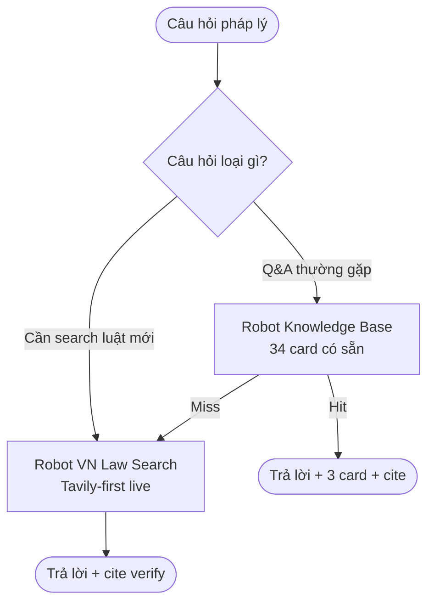

## Khi nào dùng quy trình này

- Junior LS hỏi senior nhưng senior bận
- Họp khách hàng cần tra cứu nhanh 1 câu pháp lý
- Trước khi viết memo, cần verify cite điều luật
- Daily Q&A pháp luật VN thường gặp

## Bạn cần chuẩn bị

<Steps>
  <Step title="Câu hỏi cụ thể">
    Vd: "Phạt vi phạm HĐ MB B2B max bao nhiêu %?"
  </Step>
  <Step title="Context (optional)">
    Loại HĐ / ngành / bên nào quan tâm
  </Step>
</Steps>

## Flow 2 lựa chọn

## 2 robot tra cứu

<AccordionGroup>
  <Accordion title="Robot Knowledge Base (cho Q&A common)">
    `knowledge-base` có **34 thẻ kiến thức** chia 15 chủ đề:
    
    - HĐ chung / HĐ MB B2B / HĐ DV / HĐLĐ / HĐ Vay / HĐ Đại lý
    - Thuê / FDI / Thuế / IP / Tranh tụng
    - ATVSLĐ / Doanh nghiệp / PDPL / Thừa kế
    
    **Cách hoạt động**:
    - Bạn hỏi → robot match top 3 thẻ phù hợp nhất
    - Tổng hợp câu trả lời + cite consolidated
    - **Deterministic scoring** (không random như ChatGPT)
    - Mọi cite đã verify trước → KHÔNG bịa
    
    **Ví dụ thẻ**:
    - Phạt vi phạm HĐ MB B2B max bao nhiêu %?
    - Thời hiệu khởi kiện HĐ là bao lâu?
    - Tranh chấp HĐLĐ giải quyết ở đâu?
    - Lương tối thiểu vùng I 2026 bao nhiêu?
    - HĐ Vay max lãi suất bao nhiêu %?
  </Accordion>
  <Accordion title="Robot VN Law Search (cho câu hỏi mới / chi tiết)">
    `vn-law-search` — Tavily MCP-first:
    
    **3-tier search**:
    1. **Tavily MCP primary** — search live web (TVPL, vbpl.vn, luatvietnam)
    2. **TVPL fallback** — search trực tiếp
    3. **Brave/DDG secondary** — backup khi Tavily down
    
    **Cache 24h** cho kết quả phổ biến (tiết kiệm credits).
    
    **Cite verify mandatory** — robot tự kiểm tra cite có trên vbpl.vn không trước khi return.
    
    **Out of scope** (robot KHÔNG hỗ trợ):
    - Bản án cụ thể (tra ở https://congbobanan.toaan.gov.vn)
    - Án lệ (tra ở https://anle.toaan.gov.vn)
  </Accordion>
</AccordionGroup>

## Ví dụ thật

### Câu hỏi 1: "Phạt vi phạm HĐ MB B2B max bao nhiêu %?"

**Robot Knowledge Base** trả lời:

> **8%** theo **LTM Đ.301**.
> 
> **Nuances**:
> - Áp dụng cho HĐ thương mại (B2B), KHÔNG áp HĐLĐ (BLLĐ Đ.127 K.2 CẤM phạt tiền NLĐ)
> - HĐ xây dựng có thể lên đến 12% (Luật Xây dựng)
> - Phạt KHÁC bồi thường thiệt hại — bồi thường không có cap
> 
> **Related cards**: T-card-003 (Lãi chậm trả HĐ B2B), T-card-007 (Phạt vi phạm HĐLĐ — CẤM)

**Cite verify**: ✓ LTM 36/2005/QH11 Đ.301 — link vbpl.vn

→ Thời gian: 2 giây.

### Câu hỏi 2: "NĐ 293/2025 lương tối thiểu vùng I khi nào hiệu lực?"

**Robot VN Law Search** (vì là luật mới, KB chưa có):

> NĐ 293/2025/NĐ-CP:
> - **Ký ban hành**: 10/11/2025
> - **Hiệu lực**: 01/01/2026
> - **Lương tối thiểu vùng I**: 5.31M VND/tháng
> - **Vùng II**: 4.71M, vùng III: 4.13M, vùng IV: 3.69M
> 
> So với NĐ 38/2022 (lương cũ): vùng I tăng từ 4.96M → 5.31M (+7%).
> 
> **Source**: vbpl.vn (verified live 2026-05-15)

### Câu hỏi 3: "Lãi vay max bao nhiêu %?"

**Robot Knowledge Base**:

> **20%/năm** theo **BLDS Đ.468 K.1**.
> 
> **Quá hạn**: lãi quá hạn = 150% lãi vay theo HĐ (**BLDS Đ.466 K.5**).
> 
> Vd: HĐ vay 15%/năm → lãi quá hạn = 15% × 150% = 22.5%/năm.
> 
> **CHÚ Ý**: Áp dụng CHỈ cho HĐ Vay (BLDS Đ.463). HĐ MB B2B dùng **LTM Đ.306** hoặc **BLDS Đ.357** (lãi chậm trả) — KHÔNG dùng Đ.466 K.5.

## Kết quả nhận được

<CardGroup cols={2}>
  <Card title="Câu trả lời ngắn gọn" icon="circle-check">
    1-2 câu trả lời trực tiếp + cite anchor chính
  </Card>
  <Card title="Top 3 cards (KB)" icon="layer-group">
    Mỗi card có Question + Answer + Nuances + Related
  </Card>
  <Card title="Cite verify link" icon="link">
    Link tới vbpl.vn / TVPL để bạn cross-check
  </Card>
  <Card title="Out of scope warning" icon="triangle-exclamation">
    Robot báo nếu câu hỏi ngoài phạm vi (vd: hôn nhân gia đình)
  </Card>
</CardGroup>

## Thời gian

- KB hit: 2-3 giây
- Tavily search: 10-30 giây
- **Tổng**: 5 giây - 1 phút

## Lưu ý quan trọng

<Warning>
**Robot CHỈ trả lời pháp luật quy phạm** (luật, NĐ, TT, NQ). KHÔNG trả lời:
- Bản án cụ thể (xem tại congbobanan.toaan.gov.vn)
- Án lệ (xem tại anle.toaan.gov.vn)
- Học thuật / journal articles
- Ý kiến chuyên gia / commentary
- Hôn nhân gia đình
- Hình sự
</Warning>

## Robot dùng trong flow

<CardGroup cols={3}>
  <Card title="Knowledge Base" icon="book-open-reader" href="/skills/meta/knowledge-base">
    knowledge-base (34 cards)
  </Card>
  <Card title="VN Law Search" icon="magnifying-glass" href="/skills/utilities/vn-law-search">
    vn-law-search (Tavily-first)
  </Card>
  <Card title="Citation Linker" icon="link" href="/skills/utilities/citation-linker">
    citation-linker (enrich cite → URL)
  </Card>
</CardGroup>

## Bước tiếp theo

- Nếu cần dùng cite trong artifact → robot khác tự tra (vd: drafter / auditor)
- Nếu cần memo dài → [Soạn HĐ cho client](/scenarios/soan-hop-dong) + `memo-drafter`
- Nếu cần bản án → search manual tại congbobanan.toaan.gov.vn
